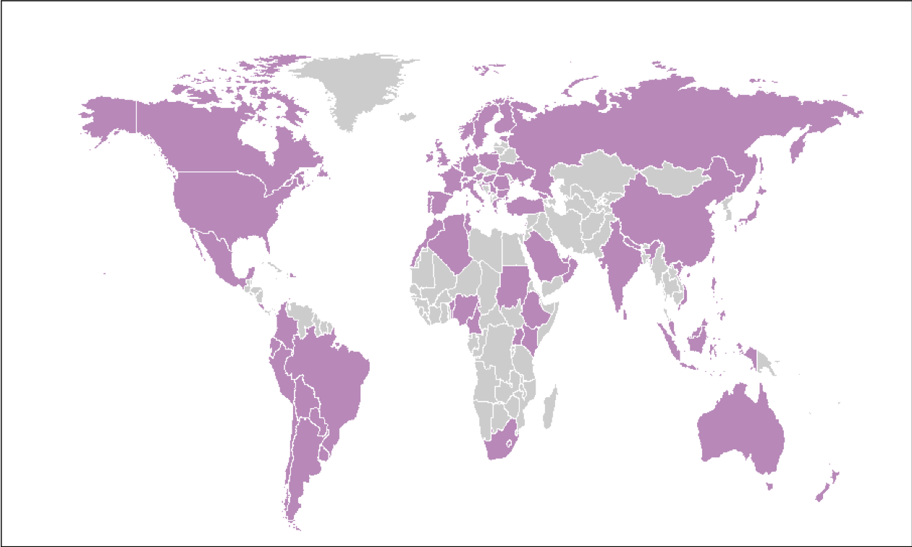
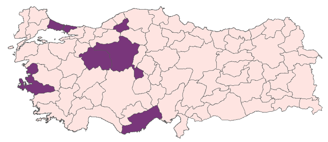

```{r xaringan-themer, include=FALSE, warning=FALSE}
library(xaringanthemer)
style_duo_accent(
  primary_color = "white",
  secondary_color = "#89389A",
  inverse_header_color = "#D3D3D3"
)
```

```{r, echo=FALSE, out.width="50%"}

```
--

 - R-Ladies, R topluluğunda cinsiyet çeşitliliğini desteklemek için kurulmuş dünya çapında bir organizasyondur.

--

 - R kullanan ve geliştiren kadınlarla bir iletişim ortamı sağlamak
 
--

 - Kadınları R kodları yazmaya, paket geliştirmeye ve R konferanslarına konuşmacı olarak katılmaya teşvik etmek

---

--
```{r, echo=FALSE,out.width="50%", fig.align='center'}

```
--

```{r, echo=FALSE, out.width="60%", fig.align='center'}

```


---

R-Ladies Global

--
```{r, echo=FALSE, out.width="50%", fig.align='center'}
knitr::include_graphics('slide4.png')
```

--
R-Ladies Türkiye &#x21A0;

---

background-position: 150% 50%
class: center, bottom, inverse

```{r, echo=FALSE,out.width="90%",fig.align='center'}

```

--

  İstanbul, 2016
 
--
 
  Ankara, 2019
 
--

  Eskişehir, 2019
  
---


```{r, echo=FALSE,out.width="70%",fig.align='center'}
knitr::include_graphics('kurucular.png')
```


--

```{r, echo=FALSE,out.width="80%",fig.align='center'}
knitr::include_graphics('slide6ek-ladies.png')
```
--

```{r, echo=FALSE,out.width="80%",fig.align='center'}

```


---

```{r, echo=FALSE,out.width="70%",fig.align='center'}

```


--
layout: false
.left-column[

```{r, echo=FALSE,out.width="10%",fig.align='left'}
knitr::include_graphics('twitter.png')
```
https:/twitter.com/RLadiesEskisehR

https:/twitter.com/RLadiesIstanbul

https:/twitter.com/RLadiesIstanbul

]

---

```{r, echo=FALSE,out.width="70%",fig.align='center'}

```
.left-column[

```{r, echo=FALSE,out.width="10%",fig.align='left'}
knitr::include_graphics('meetup.png')
```
https://www.meetup.com/rladies-eskisehir

https://https:/meetup.com/rladies-ankara

https://https:/meetup.com/rladies-istanbul
]

---

```{r, echo=FALSE,out.width="70%",fig.align='center'}

```
.left-column[

```{r, echo=FALSE,out.width="10%",fig.align='left'}

```
https://www.instagram.com/rladies-ankara
]

---

```{r, echo=FALSE,out.width="30%",fig.align='center'}

```


Webinar 1: https://youtu.be/A-zCgrfDavI

```{r, echo=FALSE,out.width="15%",fig.align='left'}

```


Webinar 2: https://youtube.com/watch?v=uCzPwMknOxQ

```{r, echo=FALSE,out.width="15%",fig.align='left'}
knitr::include_graphics('kayit2.png')
```

Webinar 3:
```{r, echo=FALSE,out.width="15%",fig.align='left'}

```


---

```{r, echo=FALSE,out.width="80%",fig.align='center'}
knitr::include_graphics('thk.png')
```

`* Slaytlar için R paketi [**xaringan**](https://github.com/yihui/xaringan) ile  [**knitr**](http://yihui.name/knitr) ve [R Markdown](https://rmarkdown.rstudio.com) kullanılmıştır.`

---

```{r, echo=FALSE,out.width="70%",fig.align='center'}

```


