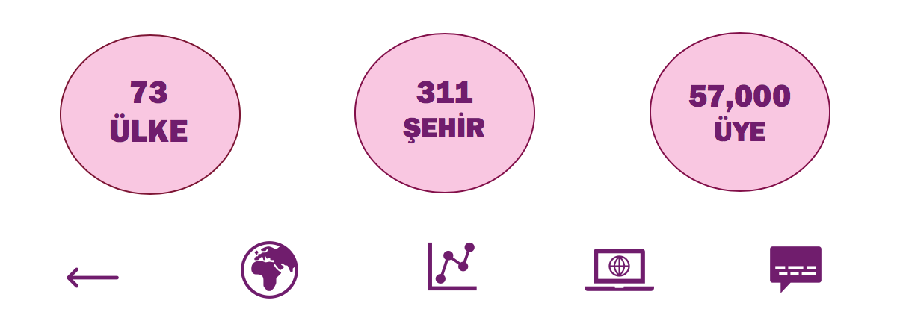
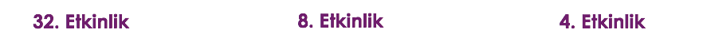

  
Webinar 4
================
2020-05-31

## 

  - R-Ladies, R topluluğunda cinsiyet çeşitliliğini desteklemek için
    kurulmuş dünya çapında bir organizasyondur.

–

  - R kullanan ve geliştiren kadınlarla bir iletişim ortamı sağlamak

–

  - Kadınları R kodları yazmaya, paket geliştirmeye ve R konferanslarına
    konuşmacı olarak katılmaya teşvik
etmek

# R-Ladies Global

–

## 

### R-Ladies Türkiye ↠

-----

background-position: 150% 50% class: center, bottom,
inverse

–

İstanbul, 2016

–

Ankara, 2019

–

Eskişehir,
2019

-----

## \# Kurucular

## 

## 

<!-- class: center, middle-->

# Teşekkürler \!

Slaytlar için R paketi [**xaringan**](https://github.com/yihui/xaringan)
ile [**knitr**](http://yihui.name/knitr) ve [R
Markdown](https://rmarkdown.rstudio.com) kullanılmıştır.
rmarkdown::render(‘foo.Rmd’, ‘pdf\_document’)
